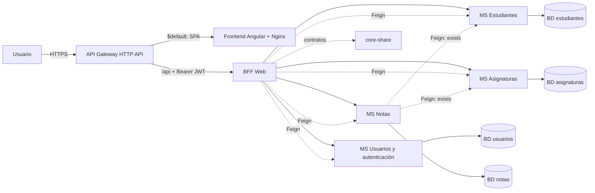

# SIGA — Sistema de Gestión Académica

Monorepo del proyecto **SIGA**, un sistema de gestión académica compuesto por un
frontend Angular, un BFF (Backend For Frontend) y microservicios Spring Boot
separados por dominio, con persistencia *database-per-service* en MariaDB.

- **Frontend**: `apps/frontend` (Angular 22 + MSAL + Tailwind CSS 4, librerías Nx).
- **Backend**: `apps/backend` (Maven multi-módulo, Spring Boot 3.5, Java 21).
- **Infraestructura**: `infra/terraform` (AWS Academy Learner Lab: EC2, EBS, ECR y API Gateway HTTP API).
- **Documentación detallada**: [`docs/`](docs/README.md).

> Estado: el núcleo académico y la orquestación del BFF (`/me` y perfil de
> estudiante) son funcionales; las pantallas de negocio del frontend y la
> observabilidad avanzada están en construcción.

## Arquitectura



Cada microservicio es dueño de su propia base de datos y expone su API REST
protegida. El frontend **solo** consume el BFF; el BFF orquesta los dominios por
Feign. La documentación completa de la arquitectura está en
[`docs/arquitectura.md`](docs/arquitectura.md).

## Stack

| Capa | Tecnología |
| --- | --- |
| Frontend | Angular 22.1, TypeScript 6, RxJS 7.8, MSAL Angular v6, Tailwind CSS 4, Nx, Vitest |
| Backend | Java 21, Spring Boot 3.5.0, Spring Cloud 2025.0.0 (OpenFeign), Resilience4j, Spring Security OAuth2, JPA/Hibernate, MapStruct, Lombok, springdoc (Swagger/Scalar) |
| Persistencia | MariaDB 11.4 (una base por microservicio), Flyway |
| Mensajería/contratos | HTTP + Feign, DTOs compartidos en `core-share` |
| Infra | Docker Compose (local), Terraform (AWS), GitHub Actions (CI/CD) |

## Estructura del repositorio

```text
SIGA-Project/
├── apps/
│   ├── backend/                  # Maven multi-módulo (ver apps/backend/README.md)
│   │   ├── libs/core-share/      # DTOs, validadores, seguridad y OpenAPI compartidos
│   │   ├── bff-web/              # BFF: /me y orquestación por Feign
│   │   ├── ms-usuarios-auth/     # usuarios, roles y Microsoft Graph
│   │   ├── ms-estudiantes/       # ficha del estudiante
│   │   ├── ms-asignaturas/       # asignaturas
│   │   └── ms-notas/             # calificaciones + Feign con fallback
│   └── frontend/                 # Angular + Nx (ver apps/frontend/README.md)
├── docs/                         # documentación (ver docs/README.md)
├── infra/terraform/              # infraestructura AWS (ver infra/terraform/README.md)
├── .github/workflows/            # CI (ci.yml) y CD (cd.yml)
├── docker-compose.yml            # stack local completo
└── .env.example                  # plantilla de variables de entorno
```

## Requisitos

- **Docker** y **Docker Compose** (para el entorno local completo).
- **Node.js 22+** y **npm** (frontend).
- **JDK 21** y **Maven** (backend; hay wrappers `mvnw` por módulo).
- **Terraform >= 1.5** y **AWS CLI** (solo para desplegar en AWS).

## Inicio rápido (Docker Compose)

```bash
# 1. Variables de entorno
cp .env.example .env          # Windows PowerShell: Copy-Item .env.example .env
#    Completar MARIADB_ROOT_PASSWORD, DB_USER, DB_PASS y las variables AZURE_*

# 2. Levantar todo el stack (bases, microservicios, BFF y frontend)
docker compose up -d --build

# 3. Ver estado y logs
docker compose ps
docker compose logs -f bff-web
```

Accesos del entorno local:

| Recurso | URL |
| --- | --- |
| Frontend (SPA) | http://localhost:4200 |
| BFF Web | http://localhost:8080 |
| Swagger BFF | http://localhost:8080/docs/swagger |
| Scalar BFF | http://localhost:8080/docs/scalar |
| Swagger usuarios | http://localhost:8081/docs/swagger |
| Health BFF | http://localhost:8080/actuator/health |

> Guía paso a paso de login y pruebas: [`docs/testing-login.md`](docs/testing-login.md).

## Servicios y puertos

| Servicio | Puerto host | Descripción |
| --- | --- | --- |
| `frontend` | 4200 | SPA Angular servida por Nginx. |
| `bff-web` | 8080 | Backend For Frontend (`/api/me`, perfil de estudiante). |
| `ms-usuarios-auth` | 8081 | Usuarios, roles y sincronización con Microsoft Graph. |
| `ms-estudiantes` | 8082 | Dominio estudiantes. |
| `ms-asignaturas` | 8086 | Dominio asignaturas. |
| `ms-notas` | 8087 | Dominio notas (Feign a estudiantes y asignaturas). |
| `mariadb-*` | interno | Una instancia MariaDB por microservicio. |

## Comandos habituales

### Docker Compose (desde la raíz)

```bash
docker compose up -d --build            # levantar/actualizar el stack
docker compose up -d --build frontend   # reconstruir un servicio
docker compose logs -f ms-notas         # seguir logs
docker compose down                     # detener (conserva volúmenes)
docker compose down -v                  # detener y borrar datos (¡destructivo!)
```

### Backend (Maven)

```bash
# Compilar y ejecutar tests unitarios de todos los módulos
mvn -f apps/backend/pom.xml -B package -Dtest='!*ApplicationTests' -DfailIfNoTests=false

# Compilar sin tests e instalar en el repo local
mvn -f apps/backend/pom.xml -DskipTests install

# Levantar un servicio concreto (incluye dependencias con -am)
mvn -f apps/backend/pom.xml -pl ms-estudiantes -am spring-boot:run
```

Detalle de módulos, endpoints y configuración en
[`apps/backend/README.md`](apps/backend/README.md) y [`docs/backend.md`](docs/backend.md).

### Frontend (npm / Nx)

```bash
# Desde apps/frontend
npm install
npm start              # ng serve en http://localhost:4200 (proxy /api -> BFF)
npm run build          # build de producción
npm test               # pruebas unitarias (Vitest)

# Desde la raíz
npx nx lint frontend
npx nx graph           # explorar el grafo de proyectos
npx prettier --write "apps/frontend/**/*.{ts,html,css}"
```

Más información en [`apps/frontend/README.md`](apps/frontend/README.md) y
[`docs/frontend.md`](docs/frontend.md).

### Infraestructura (Terraform)

```bash
cd infra/terraform
cp terraform.tfvars.example terraform.tfvars
terraform init && terraform validate && terraform plan && terraform apply
terraform output api_gateway_invoke_url   # URL HTTPS del SPA
```

Detalles de la topología AWS y secretos en
[`infra/terraform/README.md`](infra/terraform/README.md).

## Documentación

| Documento | Contenido |
| --- | --- |
| [`docs/README.md`](docs/README.md) | Índice general de la documentación. |
| [`docs/arquitectura.md`](docs/arquitectura.md) | Visión general, capas, seguridad y despliegue. |
| [`docs/backend.md`](docs/backend.md) | Microservicios, endpoints, contratos y datos. |
| [`docs/frontend.md`](docs/frontend.md) | Angular, rutas por rol, MSAL y librerías Nx. |
| [`docs/testing-login.md`](docs/testing-login.md) | Pruebas de login y del sistema con Docker. |
| [`docs/branch-cleanup.md`](docs/branch-cleanup.md) | Modelo de ramas y limpieza ejecutada. |
| [`apps/backend/README.md`](apps/backend/README.md) | Guía del backend. |
| [`apps/frontend/README.md`](apps/frontend/README.md) | Guía del frontend. |
| [`infra/terraform/README.md`](infra/terraform/README.md) | Guía de infraestructura AWS. |

## Flujo de trabajo (ramas)

```text
feature/*  ->  dev  ->  main  ->  deploy
                                 (dispara CD)
```

- `dev`: integración. `main`: estable. `deploy`: dispara el despliegue (CD).
- Ramas cortas `feature/*` y `fix/*` se eliminan al integrar.
- CI corre en push/PR a `dev` y `main`; CD es manual (`deploy` o `workflow_dispatch`).

Ver [`docs/branch-cleanup.md`](docs/branch-cleanup.md).
