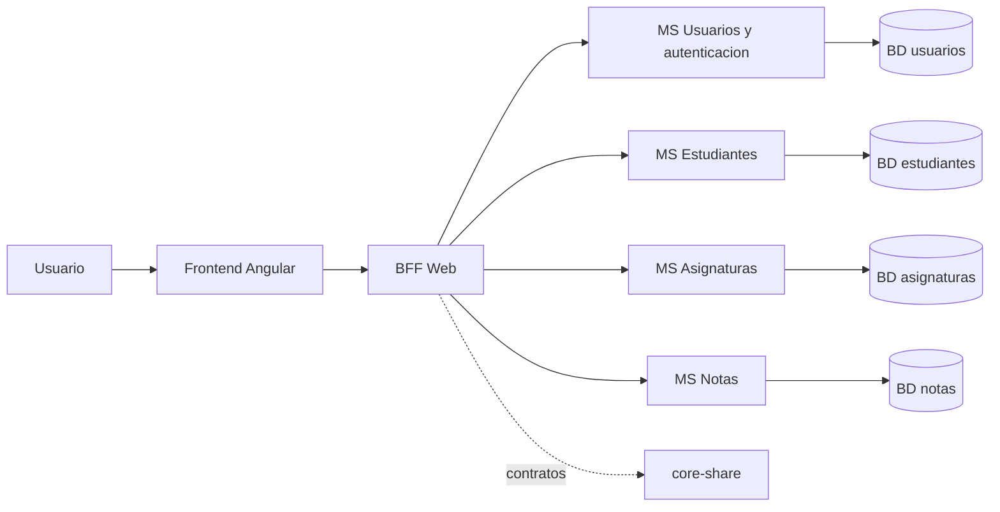

# Arquitectura de SIGA

## 1. Vision general

SIGA se plantea como un sistema de gestion academica con frontend Angular, un BFF Web y microservicios Spring Boot separados por responsabilidad. La arquitectura actual es principalmente una base de organizacion; la implementacion completa de los flujos se realizara de forma incremental.

El diagrama representa la direccion objetivo. Las bases de datos y las integraciones mostradas deben terminar de definirse durante la implementacion.

## 2. Capas

### Presentacion

`apps/frontend` contiene la aplicacion Angular, sus rutas, componentes, formularios y servicios HTTP. El navegador debe comunicarse con el BFF y no conocer la topologia interna de los microservicios.

### Entrada y orquestacion

`bff-web` concentra los endpoints orientados a la interfaz, aplica seguridad y coordina solicitudes. Tambien es el punto donde se puede combinar informacion de varios servicios para una vista del frontend.

### Dominio distribuido

Cada microservicio es dueño de un contexto funcional:

- Usuarios y autenticacion: identidad, roles y estado de cuentas.
- Estudiantes: datos personales y academicos del estudiante.
- Asignaturas: asignaturas, cursos y docentes.
- Notas: calificaciones y sus relaciones.

### Compartidos transversales

`core-share` ofrece DTO, validaciones, excepciones, seguridad y configuracion OpenAPI reutilizables. No debe contener la logica especifica de un dominio.

### Persistencia

Cada servicio debe ser responsable de su modelo y persistencia. Se preve MariaDB, con separacion logica de datos para reducir el acoplamiento entre dominios.

## 3. Flujo de una solicitud

1. El usuario inicia una accion en Angular.
2. El frontend envia la solicitud al BFF con el token JWT.
3. El BFF valida la autenticacion y la autorizacion.
4. El BFF llama al microservicio responsable, usando Feign cuando corresponda.
5. El microservicio valida la entrada, ejecuta la regla de negocio y persiste los cambios.
6. La respuesta se transforma a un DTO y vuelve al BFF.
7. El frontend muestra el resultado o un error normalizado.

## 4. Seguridad

La estrategia prevista es OAuth2/JWT, con Azure AD como proveedor de identidad. La autenticacion confirma quien es el usuario; la autorizacion por roles determina que operaciones puede realizar.

Aspectos que deben quedar definidos:

- Roles oficiales del sistema.
- Permisos por endpoint y operacion.
- Validacion del emisor, audiencia y expiracion del token.
- Propagacion segura del contexto entre BFF y microservicios.
- Rutas publicas limitadas a salud y documentacion tecnica.

## 5. Comunicacion y contratos

El BFF se comunicara con los microservicios mediante HTTP interno. Feign es la opcion prevista para clientes declarativos dentro del backend.

Los DTO compartidos deben versionarse con cuidado. Un cambio incompatible requiere una estrategia de versionado o migracion para evitar romper el frontend y los consumidores internos.

## 6. Despliegue

La base de despliegue esta compuesta por:

- Dockerfiles por servicio.
- `docker-compose.yml` para desarrollo y pruebas locales.
- Red Docker `siga-network`.
- Volumen MariaDB.
- Terraform en `terraform/main.tf` como punto de partida para infraestructura futura.

Actualmente Compose solo contiene una parte de la topologia y Terraform no tiene implementacion funcional. La evolucion prevista es completar primero el entorno local y despues definir los recursos de infraestructura, secretos, redes, bases de datos, escalamiento y observabilidad.

## 7. Observabilidad y operacion

Cada servicio debera incorporar, como minimo:

- Health checks.
- Logs estructurados.
- Correlation ID para seguir una solicitud desde el frontend hasta el servicio final.
- Metricas de errores, latencia y disponibilidad.
- Documentacion OpenAPI actualizada.

## 8. Estado actual frente a la arquitectura objetivo

| Componente | Estado actual | Objetivo |
| --- | --- | --- |
| Frontend Angular | Scaffold inicial | Modulos academicos conectados al BFF |
| BFF Web | Aplicacion y seguridad base | Orquestacion y API para la interfaz |
| Usuarios/Auth | Modelo y capa de servicio inicial | Identidad, roles y permisos completos |
| Estudiantes | Modelo y capas iniciales | CRUD, filtros y relaciones academicas |
| Asignaturas | Aplicacion y seguridad base | Gestion de asignaturas, cursos y docentes |
| Notas | Aplicacion y configuracion base | Registro y consulta de calificaciones |
| Docker Compose | Topologia parcial | Entorno local reproducible |
| Terraform | Archivo vacio | Infraestructura declarativa |
| Pruebas | Base de proyecto | Cobertura unitaria, integracion y contratos |

## 9. Principios de implementacion

- Mantener una responsabilidad clara por microservicio.
- Evitar que el frontend dependa de servicios internos.
- Compartir contratos y componentes transversales, no entidades de dominio.
- Validar entradas en el limite de cada servicio.
- Proteger todos los flujos que modifiquen informacion.
- Automatizar compilacion, pruebas y despliegue progresivamente.
