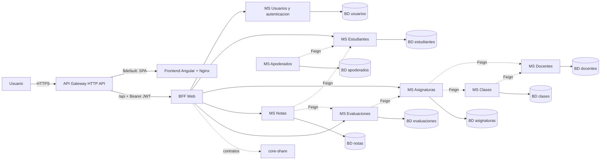

# Arquitectura de SIGA

## 1. Vision general

SIGA es un sistema de gestion academica con frontend Angular, un BFF Web y microservicios Spring Boot separados por responsabilidad. El nucleo academico es funcional, el BFF ya orquesta los dominios (`/me` y perfil de estudiante) y la infraestructura Terraform esta implementada. El frontend ya tiene **dashboards por rol** con **tema oscuro/claro**, pero esas pantallas usan **datos mock**; conectar el resto de recursos al BFF y la observabilidad avanzada siguen pendientes.

```mermaid
flowchart LR
    U[Usuario] -->|HTTPS| G[API Gateway HTTP API]
    G -->|$default: SPA| F[Frontend Angular + Nginx]
    G -->|/api + Bearer JWT| B[BFF Web]
    B --> A[MS Usuarios y autenticacion]
    B --> E[MS Estudiantes]
    B --> S[MS Asignaturas]
    B --> N[MS Notas]
    B --> V[MS Evaluaciones]
    N -. Feign .-> E
    N -. Feign .-> V
    V -. Feign .-> S
    S -. Feign .-> D[MS Docentes]
    S -. Feign .-> C[MS Clases]
    C -. Feign .-> D
    P[MS Apoderados] -. Feign .-> E
    A --> DA[(BD usuarios)]
    E --> DE[(BD estudiantes)]
    S --> DS[(BD asignaturas)]
    N --> DN[(BD notas)]
    D --> DD[(BD docentes)]
    P --> DP[(BD apoderados)]
    C --> DC[(BD clases)]
    V --> DV[(BD evaluaciones)]
    B -. contratos .-> CS[core-share]
```

Cada microservicio es dueno de su propia base de datos (database-per-service). El BFF ya orquesta los dominios: expone `/api/me` (usuario y rol) y el perfil agregado de estudiante combinando estudiantes, asignaturas y notas por Feign.

## 2. Capas

### Presentacion

`apps/frontend` contiene la aplicacion Angular (librerias Nx, rutas por rol con dashboard y sidebar, autenticacion MSAL, tema oscuro/claro, servicios HTTP). En contenedor se sirve con Nginx, que entrega el SPA y el `config.json`; en local Nginx **proxya `/api` al BFF** y en AWS el API Gateway enruta `/api` al BFF segun `bffBaseUrl`. El navegador no conoce la topologia interna. Los estilos del frontend se gestionan con Tailwind CSS 4.

### Entrada y orquestacion

`bff-web` es el punto de entrada para la interfaz: aplica seguridad, coordina solicitudes y combina informacion de varios servicios. Expone `/api/me` (usuario, email, nombre y rol) y `/api/bff/v1/estudiantes/perfil/{idExterno}` (estudiante + asignaturas + notas, resolviendo evaluacion -> asignatura) usando clientes Feign con fallback.

### Dominio distribuido

Cada microservicio es dueno de un contexto funcional:

- Usuarios y autenticacion: identidad, roles y estado de cuentas.
- Estudiantes: datos personales y academicos del estudiante.
- Asignaturas: asignaturas basicas y electivas, horarios e inscripciones.
- Notas: calificaciones asociadas a evaluaciones.
- Docentes: ficha del docente y certificados.
- Apoderados: apoderados, telefonos y estudiantes a cargo.
- Clases: cursos por nivel/letra/anio y docente jefe.
- Evaluaciones: evaluaciones por asignatura (tipo y ponderacion).

### Compartidos transversales

`core-share` ofrece DTOs, validaciones, excepciones, seguridad y configuracion OpenAPI reutilizables. No contiene logica de un dominio especifico.

### Persistencia

**Database-per-service implementado**: cada servicio tiene su propia instancia MariaDB y su propio volumen en Docker. El acoplamiento entre dominios se reduce al no compartir tablas.

## 3. Flujo de una solicitud

1. El usuario inicia una accion en Angular.
2. El frontend envia la solicitud a `/api` (el API Gateway la enruta al BFF) con el token JWT.
3. El BFF valida la autenticacion y la autorizacion.
4. El BFF llama al microservicio responsable (Feign).
5. El microservicio valida la entrada, ejecuta la regla de negocio y persiste.
6. La respuesta se transforma a un DTO y vuelve al BFF.
7. El frontend muestra el resultado o un error normalizado.

Nota: el BFF ya implementa los pasos 3 y 4 para `/me` y el perfil de estudiante; la cobertura del resto de recursos se anadira de forma incremental.

## 4. Seguridad

La estrategia es OAuth2/JWT con **Azure AD** como proveedor de identidad.

- Autenticacion: confirma quien es el usuario.
- Autorizacion: roles (`hasRole`) y scopes (`hasAuthority('SCOPE_...')`).
- **Ownership por `oid`**: APODERADO/DOCENTE/ESTUDIANTE solo modifican sus propios recursos (`SecurityUtils.requireOwnerOrAdmin`).
- Rutas publicas limitadas a salud y documentacion tecnicas.
- **Propagacion del token**: cuando un microservicio llama a otro por Feign, reenvia el `Authorization` entrante (`SharedFeignAuthConfig`), de modo que la autorizacion se evalue en destino.
- El frontend solo se comunica con el BFF.

Aspectos a completar: **exponer y consentir los 38 scopes granulares en Entra ID** (TI; el codigo ya los exige y el SPA ya los solicita) y validacion de audiencia/emisor en todos los flujos. Ver [`testing-login.md`](testing-login.md) y [`auditoria-backend.md`](auditoria-backend.md).

## 5. Comunicacion y contratos

- Comunicacion interna HTTP; **Feign** es el cliente declarativo.
- Implementado en `bff-web` (clientes Feign a estudiantes, clases, asignaturas, evaluaciones, notas, docentes, usuarios y asistencias), `ms-notas` (valida estudiante y evaluacion), `ms-asistencias` (valida estudiante y asignatura), `ms-asignaturas` (valida docente, clase y estudiante), `ms-clases` (valida docente), `ms-apoderados` (valida estudiante) y `ms-evaluaciones` (valida asignatura), con fallback **Resilience4j**.
- El BFF orquesta `/me`, el perfil de estudiante (resolviendo evaluacion -> asignatura) y la actualizacion de pupilos por el apoderado (`PUT /api/bff/v1/apoderados/pupilos/{idEstudiante}`); el resto de recursos se conectara de forma incremental.
- Nota: la validacion del vinculo apoderado-estudiante genera una llamada runtime `ms-estudiantes -> ms-apoderados` (y `ms-apoderados -> ms-estudiantes` en el alta); no es un ciclo de arranque, pero se documenta como acoplamiento conocido.
- Los `GET /search` son **paginados** (`Page<T>` con `page`, `size`, `sort`); contrato completo en [`paginacion.md`](paginacion.md).
- Los DTOs compartidos viven en `core-share` y no deben contener logica de dominio.

## 6. Despliegue

Hay dos entornos:

- **Local**: `docker-compose.yml` levanta 9 MariaDB (una por servicio), los 9 microservicios, `bff-web`, `frontend` y **RabbitMQ** (mensajeria, con UI de management en `15672`) sobre la red `siga-network`, con configuracion por `.env`.
- **AWS** (AWS Academy Learner Lab): se define en `infra/terraform` (Terraform local, state fuera del repo). Una EC2 `t3.medium` con Docker Compose levanta el stack completo: **una** MariaDB con 9 bases, los 9 microservicios, el BFF, Nginx y **RabbitMQ**. Los datos (MariaDB y RabbitMQ) viven en un volumen EBS dedicado (`/home/ubuntu/siga-data`) para sobrevivir a reinicios y reemplazos de instancia.

Flujo de entrada:

- El SPA se sirve por **HTTPS vía API Gateway** (`*.execute-api`), requisito de MSAL (Web Crypto solo existe en contextos seguros). SPA y API comparten origen (sin CORS).
- El navegador (Angular + MSAL) llama a `/api` en el mismo API Gateway con `Authorization: Bearer`.
- El **JWT Authorizer** valida el token de Entra ID (firma, `iss`, `aud`) y reenvia al BFF (`http://<eip>:8080/api/...`).
- Nginx sirve el SPA y el `config.json`. En **local (Docker)** proxya `/api` al BFF; en **AWS** esa ruta no se usa porque el API Gateway intercepta `/api/{proxy+}` y lo envia directo al BFF.
- El BFF y los microservicios revalidan el token y aplican scopes/roles (defensa en profundidad).

Esquema y datos:

- **Flyway** en cada microservicio (`ddl-auto: validate`) crea y evoluciona el esquema; una base vacia se auto-inicializa.
- `init-db.sh` crea las 9 bases y el usuario en el primer arranque de MariaDB; en instancias existentes el CD crea las bases nuevas de forma idempotente.

CI/CD:

- **CI** (`.github/workflows/ci.yml`): build y tests de backend y frontend.
- **CD** (`.github/workflows/cd.yml`): construye las imagenes, las sube a ECR y despliega por SSH. Es manual (`deploy` o `workflow_dispatch`) porque las credenciales del learner lab expiran (~4 h). El `config.json` del frontend y el `.env` de la EC2 se generan desde los secrets (`AZURE_*`, `RABBITMQ_*`), y el compose se copia desde `infra/terraform/templates/docker-compose.yml` en cada deploy para no depender del que escribio `user-data` al crear la instancia.

## 7. Observabilidad y operacion

- Health checks: `/actuator/health` en cada servicio.
- Documentacion OpenAPI por servicio (Swagger UI y Scalar).
- Correlation ID (`X-Correlation-Id`) en logs y respuestas, propagado en las llamadas Feign.
- Pendiente: logs estructurados, metricas y tracing.

## 8. Estado actual frente a la arquitectura objetivo

| Componente | Estado actual | Objetivo |
| --- | --- | --- |
| Frontend Angular | Dashboards por rol (tema oscuro/claro) con datos mock | Pantallas academicas conectadas al BFF |
| BFF Web | `/me` y perfil de estudiante (Feign + fallback) | Orquestacion del resto de recursos de la interfaz |
| Usuarios/Auth | CRUD funcional + soft delete | Identidad y permisos completos |
| Estudiantes | CRUD, busqueda, `exists`, soft delete | Matricula y relaciones academicas |
| Asignaturas | CRUD, basicas/electivas, horarios (soft delete), inscripciones, Feign | Relacion con docentes y cursos |
| Notas | CRUD, busqueda, Feign, soft delete | Reglas de periodo y calculo |
| Docentes | CRUD, certificados, busqueda, `exists` | Carga horaria y asignacion de clases |
| Apoderados | CRUD, telefonos, estudiantes a cargo, Feign | Notificaciones y seguimiento |
| Clases | CRUD, docente jefe, `exists`, Feign | Matricula y cupos por curso |
| Evaluaciones | CRUD, tipos y ponderaciones, `exists`, Feign | Calculo de promedios ponderados |
| core-share | DTOs, validadores, seguridad, errores, OpenAPI | Contratos versionados estables |
| Docker Compose | Completo (8 servicios + RabbitMQ local) | Entorno local reproducible |
| Terraform | `infra/terraform` (EC2 + EBS + API Gateway + ECR) | Infraestructura declarativa en AWS |
| Flyway | Esquema + seed en los 8 microservicios | Migraciones versionadas |
| CI/CD | GitHub Actions (CI + CD manual) | Build, tests y despliegue automatizados |
| Paginacion | `Page<T>` en los 9 `GET /search` + `siga-paginador` en el frontend | Busquedas paginadas end-to-end |
| Pruebas | Unitarios + contrato de errores + IT con Testcontainers | Cobertura unitaria, integracion y contratos |

## 9. Principios de implementacion

- Mantener una responsabilidad clara por microservicio.
- Evitar que el frontend dependa de servicios internos.
- Compartir contratos y componentes transversales, no entidades de dominio.
- Validar entradas en el limite de cada servicio.
- Proteger todos los flujos que modifiquen informacion.
- Automatizar compilacion, pruebas y despliegue progresivamente.
